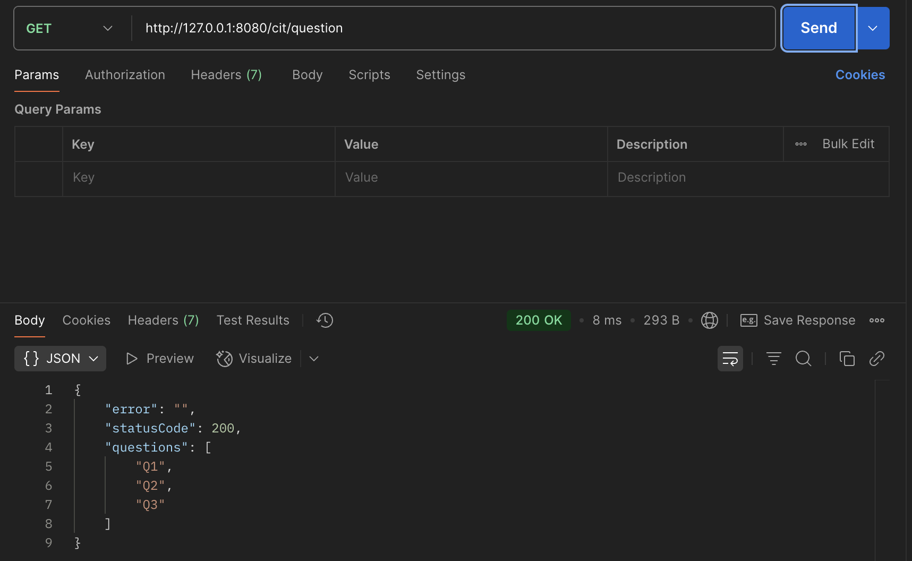
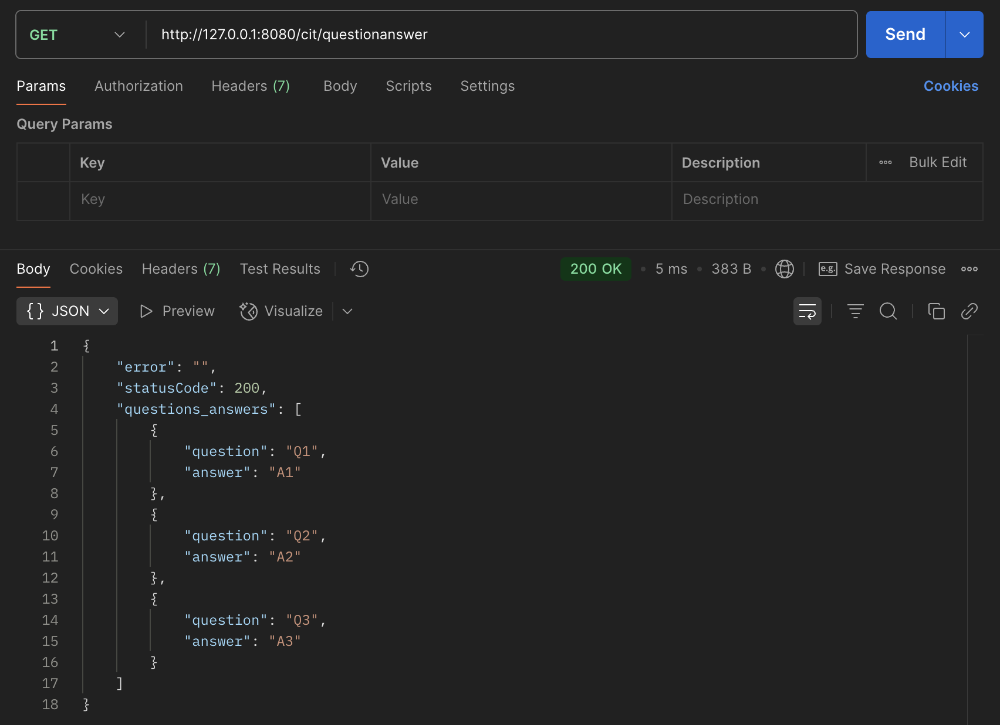
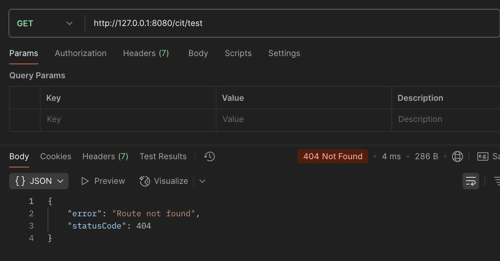
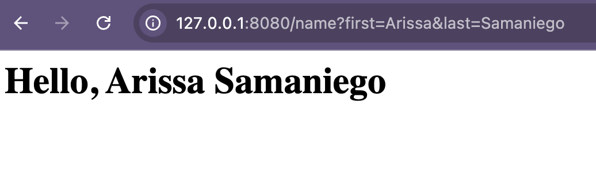

# Project 4: Node.js REST API with Express

Welcome to my Project 4 page for **CIT 281**.

---

## Purpose

This project and lab introduced how to build a REST API using Node.js and Express, emphasizing modular JavaScript, API route handling, and working with JSON data.

---

## Technologies Used

- Node.js
- Express.js
- JavaScript (ES6+)
- JSON
- REST API principles
- Postman

---

## Lab 4: Express Server Setup and Route Handling

This lab guided me through building and configuring a basic Express.js server using Node and npm, handling routes and query parameters, fixing MIME types, and managing project files with Git.

---

## What I Learned

- How to set up and structure an Express server.
- The basics of GET, POST, PUT, and DELETE API routes.
- How to modularize routes and logic into separate files.
- Best practices for handling and serving JSON data.

---

## Project Images

---

## Lab Images

---

Thanks for visiting my Project 4 page!

[Back to Portfolio](https://arissas24.github.io/)
